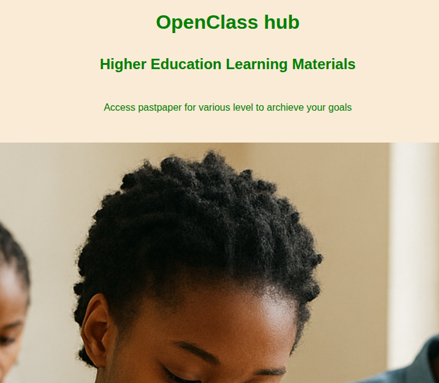

#  OpenClass - Educational Resource Platform

OpenClass is a web-based educational platform built with Django that allows students to access and share academic resources such as **past papers, notes, books, and other learning materials**.

It is designed to make learning materials easily accessible in one centralized system.

## Live Demo
🔗 https://openclass.onrender.com

##  Project Screenshots

###  Home Page

##  Features

-  Upload & access past papers
-  Share notes and books
-  Filter resources by university & level
-  Easy search and navigation system
-  Fully responsive UI (mobile + desktop)
-  Fast and lightweight design

---

##  Tech Stack

**Frontend:**
- HTML5
- CSS3
- JavaScript

**Backend:**
- Django (Python)

**Database:**
- PostgreSQL (Production - Supabase)
- SQLite (Development)

**Deployment:**
- Render

##  Installation & Setup

### 1. Clone repository
git clone https://github.com/proses-p/openclass.git
cd openclass

### 2. Create virtual environment
python -m venv venv
source venv/bin/activate   # Linux/Mac
venv\Scripts\activate      # Windows

### 3. Install all dependencies
pip install -r requirements.txt

### 4. Run migrations
python manage.py migrate 

### 5. Run Server
python manage.py runserver

### Future Improvements
AI-based study recommendations 
File upload system for users
User authentication system
Admin dashboard improvements
PDF preview inside browser

### Contributing
Pull requests are welcome. For major changes, please open an issue first.

### Developer
Proses Projectus Mpinzire
Django, Laravel Developer
Full Stack Web, mobile,desktop, Machine Learning, AI Enthusiast
